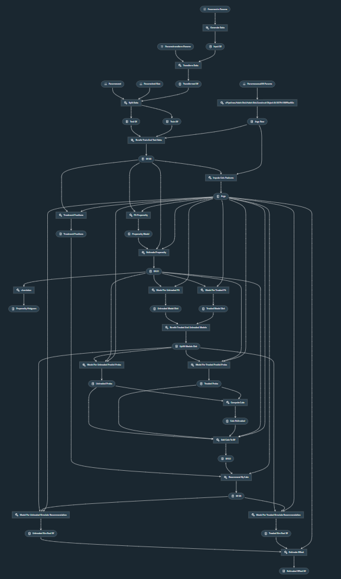

# PipelineX CausalLift

An example project using [PipelineX](https://github.com/Minyus/pipelinex), Kedro, and [CausalLift](https://github.com/Minyus/causallift) for Uplift Modeling to find which customers should be targeted and which customers should not for a marketing campaign (treatment).

<p align="center">

Pipeline visualized by Kedro-viz
</p>


## 1. Install dependencies

```bash
$ pip install pipelinex causallift xgboost kedro mlflow kedro-viz
```

Note: `mlflow` and `kedro-viz` are optional.

## 2. Clone this repository and run `main.py`

```bash
$ git clone https://github.com/Minyus/pipelinex_causallift.git
$ cd pipelinex_causallift
$ python main.py
```
## Tested environment

- Python 3.6.8


## Simplified Kedro project template

This project was created from the GitHub template repository at https://github.com/Minyus/pipelinex_template

To use for a new project, fork the template repository and hit `Use this template` button next to `Clone or download`.

<p align="center">

</p>
