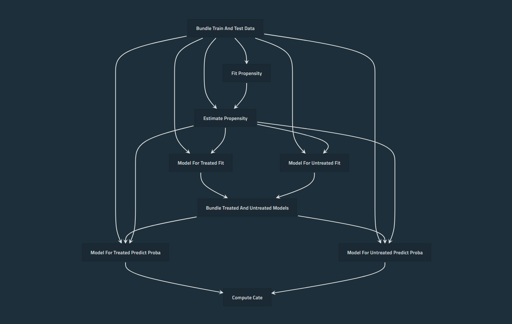

# PipelineX CausalLift

<p align="center">

</p>

Example project to use [PipelineX](https://github.com/Minyus/pipelinex) for Uplift Modeling to find which customers should be targeted and which customers should not for a marketing campaign (treatment).

Please see [CausalLift](https://github.com/Minyus/causallift) for details.

## 1. Install dependencies

```bash
$ pip install pipelinex causallift xgboost kedro
```

## 2. Clone this repository and run `main.py`

```bash
$ git clone https://github.com/Minyus/pipelinex_causallift.git
$ cd pipelinex_causallift
$ python main.py
```